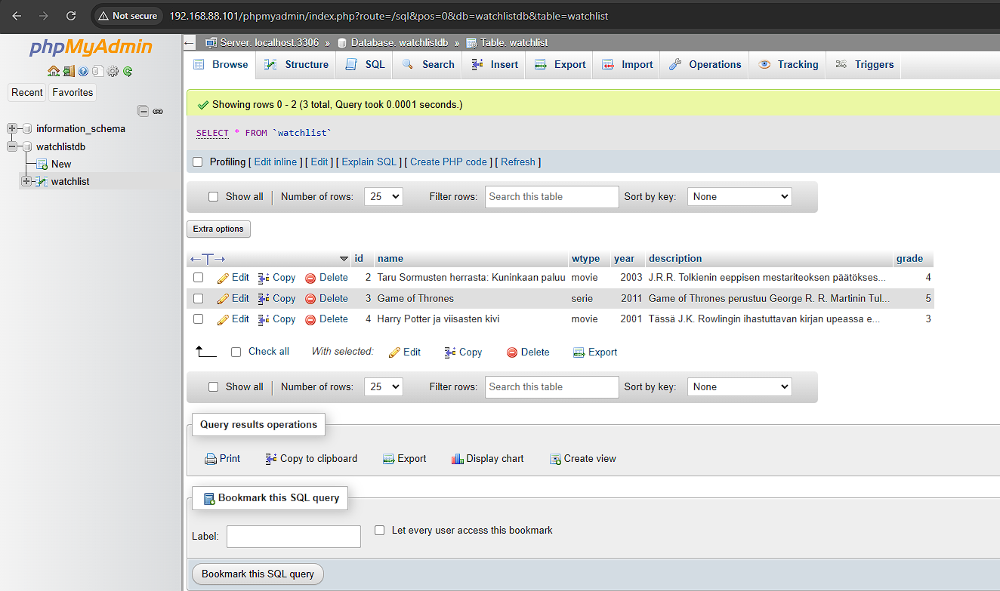

# watchlist-with-salt

This project involves creating a SaltStack module to automate the installation and configuration of [MariaDB](https://mariadb.org/). MariaDB-module generates watchlistdb-database which is for storing a list of favorite movies and series. Phpmyadmin-module creates a simple user interface for the database using [phpMyAdmin](https://www.phpmyadmin.net/).

This module performs the following tasks:

- Downloads and installs MariaDB database server.
- Creates a new Linux user and a corresponding database user.
- Grants appropriate permissions to the database user.
- Configures a database named watchlistdb and a table named watchlist.
- Downloads phpMyAdmin, Apache, php & php-mysql.
- Sets config-file for Apache and enables it.

## Installation and usage

### Prerequisites

 - Debian Linux 12 Bookworm
 - [Salt](https://saltproject.io/)
 - [Git](https://git-scm.com/)

### Instructions

1. Clone this repository to your preferred folder.

       $ git clone https://github.com/ilohil/watchlist-with-salt.git

2. Copy Salt-folder to your /srv-folder. Change the ownership to root.

       $ sudo cp -r salt/ /srv/
       $ sudo chown -R root:root /srv/salt/

3. If you want to, you can edit configure_mariadb.sls-file to set your preferred passwords and usernames. By default they are root (password: root) and admin (password: admin). Passwords are not safe in state files for production, so please use this project for test purposes only.

       $ sudoedit /srv/salt/mariadb/configure_mariadb.sls

4. Now you're ready to run the modules. Please run mariadb-module first as it setups the database for the user interface. You can run them locally:

       $ sudo salt-call --local state.apply mariadb
       $ sudo salt-call --local state.apply phpmyadmin
 
   Or you can run them on minion:

       $ sudo salt '{your minion}' state.apply mariadb
       $ sudo salt '{your minion}' state.apply phpmyadmin

5. After succesful runs you should be able to login to the database using command line or user interface. To use the command line:

       $ mariadb -u {your username} -p'{your password}'

   If you want to use the user interface, go to the following address in your browser:
    
        http://localhost/phpmyadmin/
        OR
        http://{your IP-address}/phpmyadmin/
